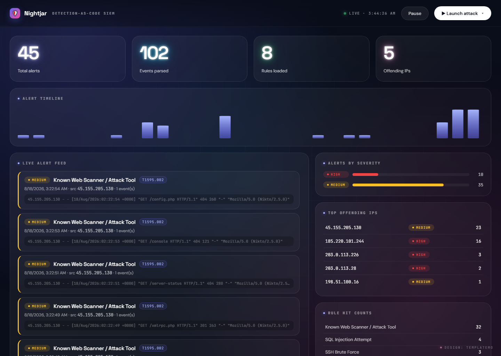

<div align="center">

# 🛡️ Nightjar

### A Detection-as-Code mini-SIEM

Ingest security logs → evaluate them against **version-controlled YAML rules** →
raise alerts mapped to **MITRE ATT&CK** → watch it all on a **live dashboard**.

Ships with an **attack replayer**, so it's alive and demoable on day one — no
server needs to actually be under attack.


</div>

<br>



<div align="center"><sub>The live dashboard after a “Full assault” — SSH brute force, SQL injection, path traversal and directory scanning, each mapped to a MITRE technique.</sub></div>

---

## Why this exists

Real detection teams write their detections **as code**: rules live in Git, get
peer-reviewed, and are tested in CI. Nightjar is a compact, honest version of
that workflow you can run on a laptop — and a way to *show* the skills recruiters
scan for: detection engineering, Sigma-style rules, MITRE ATT&CK, log parsing,
and event correlation.

> A *nightjar* is a nocturnal bird that hunts by sound in the dark. So does a SIEM.

## How it works

```
 attack replayer ─┐
   auth.log ──────┤
   nginx logs ────┼──►  parsers  ──►  events  ──►  detection engine  ──►  alerts  ──►  dashboard
   json events ───┘     (normalize    (one         (YAML rules +         (severity,     (live feed,
                         to Events)    schema)       time-windowed         MITRE ID,      charts,
                                                     correlation)          evidence)      timeline)
```

Every log source becomes a normalized `Event`, so the engine and rules never
change when you add a new parser. Detection logic lives entirely in YAML.

## Core features

| | |
|---|---|
| 🧩 **Multi-format ingestion** | Linux `auth.log` (SSH), Nginx access logs (with percent-decoding so payloads match), and generic JSON events. |
| 📝 **Rules as code** | Sigma-style YAML rules with a small but real matching grammar (`equals`, `contains`, `regex`, numeric comparisons, lists). |
| ⏱️ **Time-windowed correlation** | *"≥5 failed SSH logins from one IP in 60s → brute force."* Group-by + count + timeframe, with window reset after firing. |
| 🎯 **MITRE ATT&CK mapping** | Every alert carries its technique ID (e.g. `T1110` Brute Force) and the triggering events as evidence. |
| 📊 **Live dashboard** | Alert feed, alerts-by-severity, top offending IPs, rule-hit counts, and a timeline — polling every few seconds. |
| 🎬 **Attack replayer** | Generates realistic SSH / web / full-assault scenarios on demand, mixed with benign noise so the engine has to earn its alerts. |

## Quick start

```bash
python -m venv .venv
# Windows:  .venv\Scripts\activate
# Unix:     source .venv/bin/activate
pip install -r requirements.txt
```

```bash
# 1. Generate a realistic attack scenario into ./data
python -m nightjar.cli replay --out data

# 2. Run detections over it and print alerts
python -m nightjar.cli detect --logs data --rules rules

# 3. Launch the live dashboard  →  http://127.0.0.1:8000
python -m nightjar.cli serve
```

On the dashboard, hit **▶ Launch attack** to fire a scenario and watch the
alerts, charts, and timeline update live.

## The attack scenarios

The replayer (and the dashboard's **Launch attack** menu) can stage three
scenarios — each produces a distinctly different picture:

| Scenario | Simulates | Rules it trips |
|----------|-----------|----------------|
| 🔑 **SSH brute force** | Rapid failed logins + username spraying | `ssh-bruteforce` (T1110), `ssh-user-enumeration` (T1589.001) |
| 🌐 **Web attack** | sqlmap-style SQLi, path traversal, Nikto directory scan | `web-sqli-attempt`, `web-path-traversal` (T1190), `web-scanner-user-agent`, `web-directory-scanning` |
| 💥 **Full assault** | Everything at once | All of the above |

## Writing a rule

Rules live in [`rules/`](rules/) — one YAML file per detection, diffable and
reviewable like any other code:

```yaml
id: ssh-bruteforce
title: SSH Brute Force
severity: high
mitre: [T1110]
description: Five or more failed SSH logins from a single source IP in 60 seconds.
detection:
  event_type: ssh_failed_login   # match condition(s), AND-ed together
correlation:
  group_by: src_ip               # windowed: 5 matches per IP within 60s
  count: 5
  timeframe: 60
```

The full matching grammar (operators, event fields per source, correlation) is
documented in [`docs/RULES.md`](docs/RULES.md).

## Project structure

```
nightjar/
├── models.py            # Event / Alert  (zero-dependency dataclasses)
├── parsers/             # auth.log, nginx, JSON  →  normalized Events
├── engine/              # YAML rules + matcher grammar + correlation
├── replay/              # the attack replayer / scenario generator
├── pipeline.py          # load → detect → summarize
├── api/                 # FastAPI JSON API + the live dashboard
└── cli.py               # replay / detect / serve
rules/                   # 8 Sigma-style detection rules, MITRE-mapped
tests/                   # 17 tests (parsers, engine, end-to-end)
docs/                    # rule-authoring guide + this screenshot
```

The detection core (`models`, `parsers`, `engine`) has **no third-party
dependencies** — only the dashboard pulls in FastAPI, so the engine runs anywhere.

## Testing

```bash
pip install pytest
python -m pytest
```

17 tests cover the parsers, the matcher grammar, time-windowed correlation, and
a full replay → detect end-to-end run.

## Roadmap

- [ ] **ThreatPulse enrichment** — enrich alert source IPs against the sibling
      *ThreatPulse* project so the two plug into each other: a platform, not two toys.
- [ ] **CI** — a GitHub Action that lints rules and runs detections against fixtures.
- [ ] **More parsers** — Windows Event Log, Suricata EVE JSON.

## Credits

- Dashboard visual design adapted from the **[Lustro](https://templatemo.com/tm-624-lustro-slideshow)** template by [TemplateMo](https://templatemo.com) (free HTML/CSS template).
- Fonts: Space Grotesk, DM Sans, JetBrains Mono (Google Fonts).

> ℹ️ The dashboard loads its fonts from Google Fonts, so it looks its best with
> internet access; offline it falls back to system fonts. The detection engine
> and CLI work fully offline.

## License

[MIT](LICENSE)
